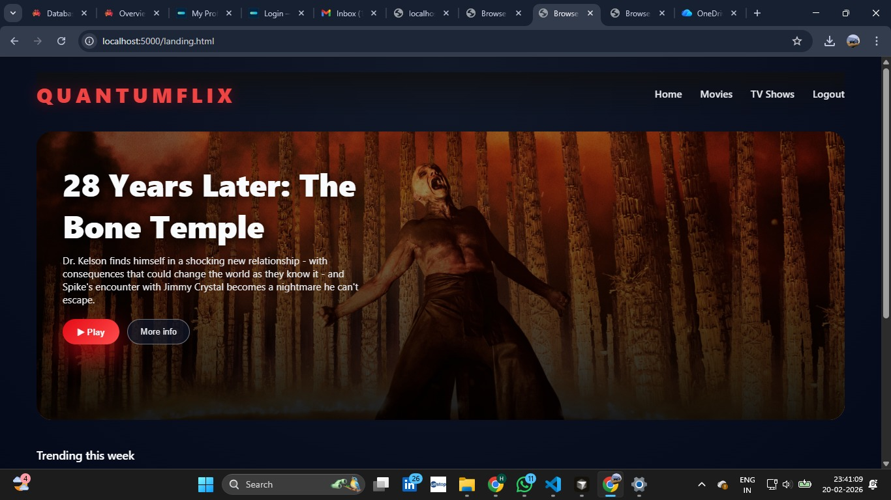
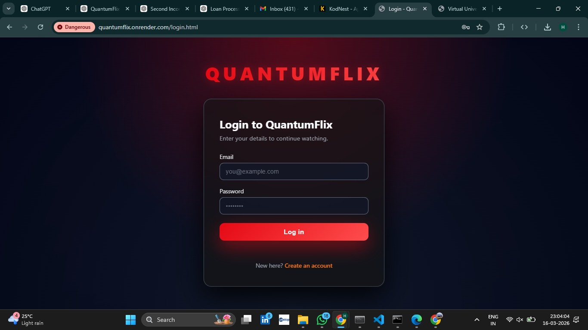
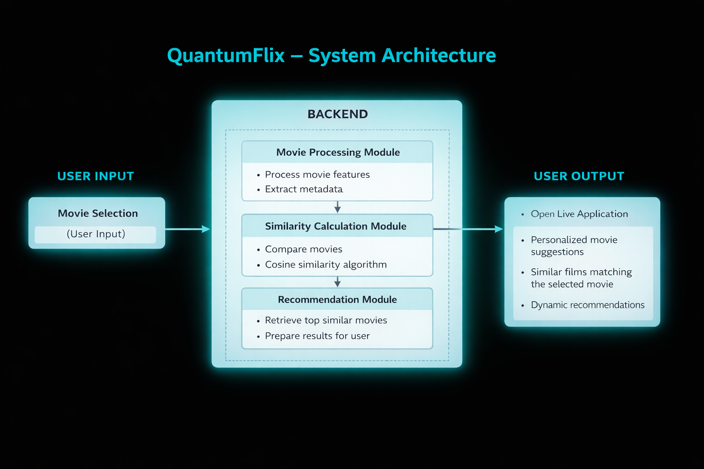

# QuantumFlix – AI Movie Recommendation System

> A machine learning–driven web application designed to provide personalized movie recommendations by analyzing movie metadata and computing similarity between films.

QuantumFlix is an AI-powered movie recommendation platform that suggests movies based on similarity algorithms and machine learning techniques. The system analyzes movie metadata such as genres, ratings, and descriptions to recommend movies similar to the user's selected movie.

This project demonstrates the integration of machine learning algorithms, web technologies, and backend systems to create an intelligent movie recommendation platform.

---

## Important Note

This repository contains the core components and representative implementation of the QuantumFlix system.

Some development resources such as experimental datasets, local testing environments, and intermediate development iterations are not included in this public repository.

Only the necessary files required to demonstrate the functionality and system design of the project are provided.

---

## Project Overview

Modern streaming platforms provide thousands of movies and shows, making it difficult for users to find content that matches their interests.

QuantumFlix solves this problem by using machine learning similarity algorithms to recommend movies that are most similar to the movie selected by the user.

The system processes movie features and computes similarity scores to generate personalized recommendations.

---

## Problem Statement

Users often struggle to discover movies that align with their interests due to the large content catalogs available on streaming platforms.

QuantumFlix addresses this challenge by:

- Analyzing movie metadata
- Computing similarity between movies
- Recommending relevant movies based on the selected movie

This improves movie discovery and enhances user experience.

---

## Live Website

Live Application:

https://quantumflix.onrender.com/

---

## High-Level System Architecture

    User selects a movie
            ↓
    Movie metadata processing
            ↓
    Feature extraction
            ↓
    Cosine similarity algorithm
            ↓
    Recommendation engine
            ↓
    Top similar movies retrieved
            ↓
    Results displayed to user

---

## Application Screenshots

### Web Interface

### Login Page

### Registration Page

---

## System Architecture

---

## Working Process

1. User logs into the QuantumFlix platform
2. User selects a movie
3. Movie metadata is processed
4. Cosine similarity algorithm compares movies
5. Top similar movies are retrieved
6. Recommended movies are displayed

---

## Technologies Used

- Node.js
- Express.js
- MongoDB
- Machine Learning
- HTML
- CSS
- JavaScript

---

## Results

QuantumFlix successfully demonstrates how machine learning similarity algorithms can be integrated with web technologies to build a functional movie recommendation system.

The platform provides fast and relevant movie recommendations through an interactive web interface.

---

## Repository Structure

quantumflix/
│
├── assets/
│   ├── interface.jpeg
│   ├── login_page.jpeg
│   ├── registration_page.jpeg
│
├── public/
├── routes/
│
├── architecture.png
├── db.js
├── index.html
├── style.css
├── script.js
│
└── README.md

---

## Author

HARSHITHA M V

AI & ML Engineer – Final Year Project

Research Interests:
- Artificial Intelligence
- Machine Learning
- Recommendation Systems
- Web-Based AI Applications
